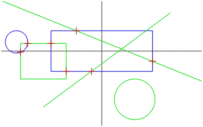

# homog2d

Current test status:
[](https://travis-ci.com/skramm/homog2d) (GCC and Clang)
[](https://www.mozilla.org/en-US/MPL/)

A single-file header-only C++ library dedicated to
handling 2D lines, points and homographies (2D planar transformations),
using (internally) [homogeneous coordinates](https://en.wikipedia.org/wiki/Homogeneous_coordinates).



- Language: C++14
- Home: https://github.com/skramm/homog2d
- Usage: just fetch the file `homog2d.hpp`, put it somewhere, and "#include" it in your source file. No build!
- Status: beta
- Author: Sebastien Kramm, firstname.lastname@univ-rouen.fr
- Licence: MPLv2


Short preview:

```C++
#include "homog2d.hpp"
using namespace h2d;
int main()
{
	Line2d l1( Point2d(10,10) );                 // a line passing through (0,0) and (10,10)
	Line2d l2( Point2d(0,10), Point2d(10,0) );   // a line passing through (0,10) and (10,0)
	Point2d pt = l1 * l2;                        // intersection point (5,5)
	Homogr H(2,3);                               // a translation matrix
	std::cout << H * pt;                         // prints [7,8]
}
```

:new: Fresh 2.4 release! : https://github.com/skramm/homog2d/releases

To install on your machine, copy file `homog2d.hpp` somewhere, or `sudo make install` after cloning repo.
This will copy that file in `/usr/local/include`.


- Audience: any C++ dev requiring some basic computational geometry, without the burden of large scale framework.

- Usage: see [full manual](docs/homog2d_manual.md)

- Reference: once downloaded, enter `make doc` (requires Doxygen).

- A test file is provided, needs [Catch](https://github.com/catchorg/Catch2).
When installed, run `$ make test` (or `$ make testall` for testing with all 3 numerical types).

- **Contributing**: at present, the best you can do is testing and bug/issue reporting.
Don't hesitate, this is still beta but stable release expected soon!

- Rationale:
  - Usage simplicity, max flexibility
  - No dependency [(*)](#rm_fn)
  - Modern C++, using policy-based design, tag dispatching, sfinae, ...
  - Direct bindings with [OpenCv](https://opencv.org/) (optional)

- Related libraries:
  - [Opencv](https://docs.opencv.org/) the reference CV library, much more algorithms, but no direct support for homogeneous geometry.
  - [Wykobi](http://www.wykobi.com/), has much more computational geometry features but no direct support for homogeneous geometry.


- [Release history](docs/homog2d_history.md)


(*):
<a name="rm_fn"></a>
Except for some additional features, see [manual](docs/homog2d_manual.md).
