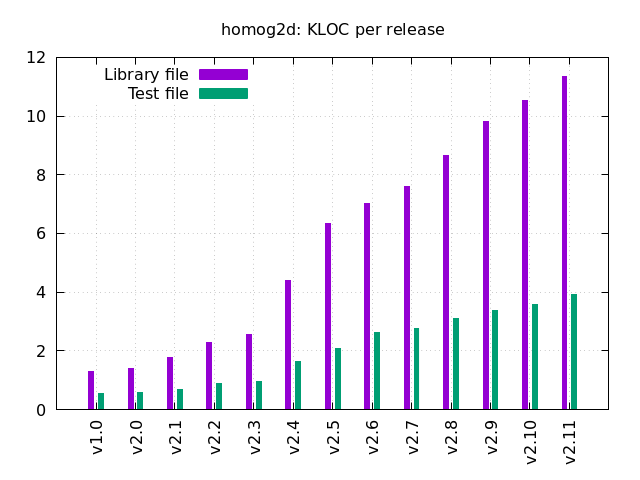

# History

[Manual main page](homog2d_manual.md)

See [Release page](https://github.com/skramm/homog2d/releases).

- planned (no specific order):
  - Ellipse/line, ellipse/ellipse intersection (hard task...)
  - add polygon union and intersection
  - add non-convex polyline splitting into polygons
  - extend run-time polymorphism capabilities
  - add list-initialization with points to `PolylineBase` class
  - cleanout the `Intersect()` family of functions, so that they always return the same type
  - add some feature to be able to print coordinates with desired precision at runtime
  - add `Vector` type (defined by dx,dy)

- current master branch
  - fixed normalization for points and lines
  - added points at infinity tests
  - added `findNearestPoint()`, `findFarthestPoint()`, `findNearestFarthestPoint()` and demo
  - added `getClosestPoints()` between two Polyline objects ([see demo](homog2d_showcase.md#sc14)).
  - added `img::putText()`, to write text on backend image, and related `img::DrawParams::setFontSize()`
  - added `side( Point2d, Line2d )`
  - fixed intersection of `FRect` and `Line2d`: now returns a `IntersectM` type, because there can be only one intersection point (TODO: same for Circle/Circle)
  - added showcase16
  - fixed issues occuring with msvc in c++17 mode with flag `/permissive-` (see https://github.com/skramm/homog2d/issues/5)
  - fixed issues with inlining (thanks to @Djuego for pointing out!)
  - added build symbol `HOMOG2D_NOWARNINGS`, see [buid options](homog2d_manual.md#build_options).
  - added support for big math library [ttmath](https://www.ttmath.org/) (preliminar, see [Numerical data types](homog2d_manual.md#bignum).).
  - add `getOrthogPts()` and `getOrthogSegs()` to class `Segment`.

## Previous releases

:

- [v2.9](https://github.com/skramm/homog2d/releases/tag/v2.9), released on 2022-11-23
  - added SVG drawing
  - added SVG import, see [related manual section](homog2d_manual.md#svg_import).
  - enable run-time polymorphism (wip), through class `detail::Common`
  - added variable frame rate for showcase demos, see `misc/showcase/gif_duration.data`
  - added constructor for horizontal or vertical line using a point
  - added bounding box for a container holding any primitive (see [manual/misc. section](homog2d_manual.md#misc))
  - added `Frect` constructor using a pair of points
  - added SVG import for angled ellipses
  - added code to get the extreme points (bottom, top, left,right) of a Polyline and a set of points
  ([see here](homog2d_manual.md#poly_extremum_points))
  - __breaking changes__:
    - renamed `Segment_::getMiddlePoint()` by `Segment_::getCenter()`
    - renamed `FRect_::center()` by `FRect_::getCenter()`

- [v2.8](https://github.com/skramm/homog2d/releases/tag/v2.8), released on 2022-08-02
  - extended circle API, with building from 2 or 3 points, see [manual](homog2d_manual.md#p_circle)
  - added `areCollinear()` to check for colinearity of 3 points, see [manual](homog2d_manual.md#misc)
  - added `getBisector()` to class `Segment_`, return bisector line
  - added `area()` and `length()` to class `Circle_` and class `Ellipse_` (member and free functions)
  - improved ellipse demo (Opencv-dependent)
  - added `isInf()` to check if points are at infinity
  - added `type()` function to all primitives, will return a `Type` enum, that can be printed with `getString()`
  - added `getExtended()` to class `Segment_` and class `FRect_`
  - added `getOrthogSegment(Point2d_)` to `Line2d_`
  - added `distTo()` between a point and a segment
  - added `split()` to segments
  - fixed `isInside()` member functions
  - added `getRotatedLine()` to class Line2d_
  - added `getParallelSegs()` to class `Segment_`
  - added `rotate()` to class `Polyline_`

- [v2.7](https://github.com/skramm/homog2d/releases/tag/v2.7), released on 2022-05-18
  - added `translate()` to `Segment`
  - added `img::write()` abstraction member function for image disk writing
  - added initializing `Segment` from a `std::pair` of points (constructor and `set()` member function)
  - added `convexHull()` and associate demo
  - added generic drawing function (for containers) with a `std::function` as third argument
  - added "Segments" demo
  - added arguments to abstract `img::clear()`, and added `img::Color` data type
  - moved base classes from main namespace to sub-namespace
  - cleaned out segment/line, segment/segment, segment/circle intersection code
  - added convexity test for `Polyline_` types.

- [v2.6](https://github.com/skramm/homog2d/releases/tag/v2.6), released on 2021-12-21
  - added threshold as default argument to `Ellipse::isCircle()`
  - fixed manual typos, added "dev" doc page
  - added speed test, manual edits
  - added missing intersection function (`FRect`/`Polyline`)
  - added binding template constructor for points/lines (see `HOMOG2D_BIND_X`)
  - added centroid computation to `Polyline_`
  - added minimizing function to `Polyline_`
  - added generalized `getBB()` to get the bounding box of two arbitrary objects
  - added more tests
  - added some missing free functions
  - API changes: refactoring of `Polyline` class, now split in two classes, `CPolyline` and `OPolyline` (closed and open)
  - many bugfixes and improvments
  - added precision tests, plots, and details on thresholds, see [homog2d_thresholds.md](homog2d_thresholds.md).
  - added lots of code demos and showcases as gif images, see [homog2d_showcase.md](homog2d_showcase.md).

- [v2.5](https://github.com/skramm/homog2d/releases/tag/v2.5), released on 2021-07-31
  - switch to C++14 (so we can use `auto` return types!)
  - added generalised `getBB()` and `FRect::getBoundingCircle()`
  - added constructor to build horizontal of vertical lines
  - `Polyline`: added `length()`, `area()`, `isPolygon()`, `getBB()`
  - added `FRect::intersection`, to get the  intersection area
  - added `Ellipse` type, and associated homography (circle=>ellipse and ellipse=>ellipse)
  - added speed test to compare Ellipse code with and without memory/speed tradeoff (see [build_options](homog2d_manual#build_options) for details).
  - renamed `CvDrawParams` => `DrawParams` (intent: planning multiple graphics back-end)
  - added `Frect` union and intersection areas: `unionArea()` and `intersectArea()`, associated operators and free functions
  - added normalization to closed `Polyline` so that they can be compared
  - classes `Point2d`, `FRect`, `Circle`, `Polyline` and `Ellipse` now all have a `translate(dx,dy)` member function

- [v2.4](https://github.com/skramm/homog2d/releases/tag/v2.4), released on 2021-07-12
  - **Major release, some API changes**
  - renamed namespace to `h2d` (shorter)
  - added a template class `KeyboardLoop` to handle keyboard inputs and loop in Opencv demo
  - added some static "no build" checking for illegal code instanciation (see target `nobuild` in makefile)
  - added operator * to apply homography to all elements of a container holding points or lines
  - added templated types `Circle_`, `Polyline_`, `FRect_` and associated code (intersection, isInside, ...)
  - added `type()` and `dtype()` to root class (and associated enums), to be able to fetch underlyng type at runtime.
  - renamed `intersectsCircle()` and `intersectsRectangle()` to `intersects()`
  - changed enums for class enums
  - deprecated `Root::addOffset()`
  - Homography now automatically inverted/transposed for lines, [see here](homog2d_manual.md#line_homography).
  - solved numerical rounding issues
  - renamed `Segment::get()` to `Segment::getPts()` and `FRect::get2Pts()` to `FRect::getPts()`
  - enhanced `Polyline` class (intersection code, ...)
  - added `Polyline::isPolygon()`, `Polyline::length()` and corresponding free functions
  - added `getBB()` (member function and free functions) to `Polyline`, `Segment` and `Circle`

- [v2.3](https://github.com/skramm/homog2d/releases/tag/v2.3), released on 2021-06-18
  - switch to MPLv2 licence
  - all computations are now done using default numerical type `HOMOG2D_INUMTYPE`
  - added `buildFrom4Points()` to Homography class
  - added templated conversion free functions and member function to Opencv point types
  - added full testing with all three arithmetic types (`make testall`)
  - added segment type and associated features
  - demo code heavy refactoring (requires Opencv)

- [v2.2](https://github.com/skramm/homog2d/releases/tag/v2.2), released on 2021-06-01
  - added 2 constructors to `Homogr`
  - added `isParallelTo()`
  - API change:
    - renamed `drawCvMat()` to `draw()` (to make transition to other graphical backends easier)
    - matrices: renamed `setValue()` to `set()` and `getValue()` to `get()`
    - for OpenCv matrices, replaced `getFrom()` by assignment operator
    - replaced enums `En_OffsetDir` and `En_GivenCoord` with class enums `LineOffset` and `GivenCoord`
  - added `Segment` type and associated code
  - Licence change to MPLv2
  - replaced `HOMOG2D_SAFE_MODE` with `HOMOG2D_NOCHECKS`, so that checking is enabled by default.

- [v2.1](https://github.com/skramm/homog2d/releases/tag/v2.1), released on 2020-04-27.
  - added `intersectsCircle()`, to get intersection with circles
  - intersection data structure name changed, now `Intersect`
  - the intersection points are now private, they must be fetched with `get()`:
  this `Intersect` member function will return a `std::pair` holding the two intersection points.
  - added `getPoints()`
  - added single argument constructors
  - renamed `distToPoints()` member function: now `distTo()`, and can be used with lines as argument.
  - added new matrix type: `Hmatrix`, for point to line (or line to point) mapping.
  - renamed `clear()` to `init()` for matrices
  - added `getParallelLine()`

- [v2.0](https://github.com/skramm/homog2d/releases/tag/v2.0): fully templated.

- [v1.0](https://github.com/skramm/homog2d/releases/tag/v1.0): initial release, not templated by numerical data type.
Same API, works fine. A bit lighter on template stuff.

### Footnotes

[(1)](#paedfapol)
 The rationale behind this interface is that if we had choosen to pass a point as argument, no guarantee would have been given that the point is effectively lying on the line.
With this function signature, the function can compute the point itself.
