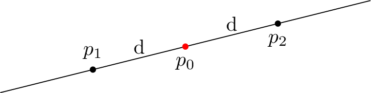
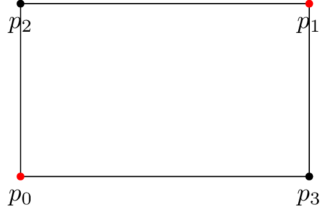
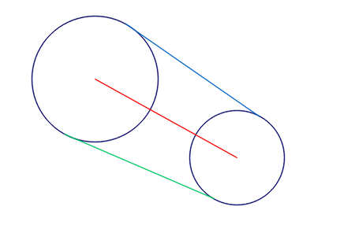

# Manual

Home page: https://github.com/skramm/homog2d

This is the manual for the current master branch of `homog2d`.
For stable releases, see home page.

1. [Introduction](#intro)
2. [Lines and points](#basic)
3. [Segments](#segments)
4. [Other geometric primitives](#shapes)
5. [2D transformation (aka homographies)](#matrix)
6. [Computing Intersections](#inter)
7. [Bindings](#bind)
8. [Numerical data types](#numdt)
9. [Technical details](#tech)
10. [History](homog2d_history.md)


## 1 - Introduction
<a name="intro"></a>

All the code is in the namespace `homog2d`, so either add `using namespace homog2d`, either use it as a prefix on each type.

This library provides several main data types: lines, points, segments, and homography matrices, that can be used to transform (planar transformation) one of the basic types.
It is implemented as a homogeneous 3x3 matrix.
It also provides some additional types, derived from these.

## 2 - Lines and points
<a name="basic"></a>

- Create or edit a 2D point:
```C++
Point2d pt1;       // 0,0
Point2d pt2(3,4);
pt1.set( 5, 6 );
```

- Create a 2D line:
```C++
Line2d li1;             // vertical line at x=0
Line2d li2( 3, 4 );     // line passing through (0,0) and (3,4)
```

- Create a point from two lines, and a line from two points:
```C++
Point2d pt3( li1, li2 );
Line2d  li3( pt1, pt2 );
```

- Get a line from two points, and a point from two lines:
```C++
pt1 = li1 * li2;
li1 = pt1 * pt2;
```

Beware, two parallel lines will never cross, and two identical points do not define a line.
So if your code attempts to do so, this will trigger a
[std::runtime_error](https://en.cppreference.com/w/cpp/error/runtime_error)
exception.<br>
If you are unsure, you can check first:
```C++
if( li1.isParallelTo(li2) )
	cout << "Lines are parallel !\n";
```

For points, it is as easy as:
```C++
if( pt1 == pt2  )
	cout << "Points are identical !\n";
```
For the numerical considerations on this,
check below, section [Numerical data types](#numdt).


To get the euclidean coordinates of a point, two member functions are provided:
```C++
auto x = pt.getX();
auto y = pt.getY();
```
Or use the equivalent free functions:
```C++
auto x = getX(pt);
auto y = getY(pt);
```


To get the 3 components of a line as a homogeneous array, one may use:
```C++
auto v = line.get();
std::cout << '[' << v[0] << ',' << v[1] << ',' << v[2] << '\n';
```

- Compute distances from line to point or from point to point:
```C++
Line2d li;        // some line
Point2d pt1, pt2; // some points
auto dist1 = li1.distTo( pt1 );   // distance from line to point
auto dist2 = pt1.distTo( li1 );   // but you can do this too
auto dist2 = pt2.distTo( pt1 );   // distance from point to point

Line2d li2;
// auto dist = li.distTo( li2 );   // this does not build !
```

### Get point(s) lying on line

To get a point lying on a line, you can provide one of its coordinates and get the other coordinate value, using the enum
`GivenCoord`.
For example, if you build the line going through (0,0)-(4,2) with:

```C++
Line2d li(4,2);
```
You can compute the coordinate of y for x=2 with:
```C++
auto y = li.getCoord( GivenCoord::X, 2 );
```
of get the coordinate of x for y=1 with:
```C++
auto x = li.getCoord( GivenCoord::Y, 1 );
```

You can also get directly the point with:
```C++
Point2d pt2 = li.getPoint( GivenCoord::X, 2 );
```

Some care has to be taken with these functions, because they will throw if unable to provide a result.
For example, if you try to get the 'y' coordinate from a vertical line, this will fail.
The following code will throw:

```C++
Line2d li;
auto y = li.getCoord( GivenCoord::X, 0 );
```

### Points at equal distance from a point on line
<a name="paedfapol"></a>

You can compute the two points that are lying on a line and at a given distance from a point.



The API provides two ways to get these.

- either you provide the x or y coordinate:
```C++
Line2d li( ..., ... ); // some line
auto ppts = li.getPoints( GivenCoord::X, coord, dist ); // returns a std::pair
Point2d p1 = ppts.first;
Point2d p2 = ppts.second;
```
The drawback is same as the above paragraph: if line is vertical/horizontal (or near), these can fail.

- either you provide directly the point:
```C++
Line2d li( ..., ... ); // some line
Point2d pt_on_line;
auto ppts = li.getPoints( pt_on_line;, dist ); // returns a std::pair
```
The drawback is that you need to be sure that this point is truely on the line.
This will be checked for, and library will throw if not
(except if error checking is disabled, see [build options](#options)).

Upon return, the "first" point will hold the one with smallest 'x' coordinates, or the smallest 'y' coordinates if x coordinates are equal.

### Orthogonal and parallel lines, angles between two lines

You can compute a line orthogonal to another one at a given coordinate, using the above enum.
For example, this:
```C++
Line2d li2 = li.getOrthogonalLine( GivenCoord::X, 2 );
```
will build `li2` so that it is orthogonal to `li` at `x=2`.

Similarly, you can also directly use as input a point on the line:
```C++
Line2d li2 = li.getOrthogonalLine( some_point_on_line );
```
Again, point is checked and this will throw if distance from point to line is above some threshold
(see ["numerical issues"](#num_issues))

You can get a line parallel to another one with the member function `getParallelLine()`.
This function takes as argument a point that the line will intersect.

```C++
Line2d li1; // some line
Point2d pt; // some point
Line2d li2 = li1.getParallelLine( pt ); // pt will be lying on li2, wich is parallel to li1
```

If you need a parallel line to another at a given distance, then you can use
`getParallelLines()`, provided either as a free function or as a member function.
They both return a pair (`std::pair`) of lines, one on one side, and the other on the other side of the input line:
```C++
Line2d li; // some line
auto p_lines1 = li.getParallelLines( 100 );
auto p_lines2 = getParallelLines( li, 50 );
auto liA = p_lines1.first;
auto liB = p_lines1.second;
```

You can compute the angle in Radians between two lines, either with a member function or with a free function:
```C++
auto angle1 = li2.getAngle( li1 );
auto angle2 = getAngle( li1, li2 );
```

You can check if a line is parallel to another line:
```C++
Line2d l1,l2; // some lines
bool it_is = l1.isParallelTo( l2 );
```

## 3 - Segments
<a name="segments"></a>

A segment is implemented internally as a pair of points.
Usage is straightforward:
```C++
Segment s1( Point2d(12,34), Point2d(45,67) );
Segment s2; // default value
std::cout << s2;  // prints "(0,0) - (1,1)"
s2.set( Point2d(12,34), Point2d(45,67) );
```
You can get the pair of points (as an `std::pair`) with `get()`.
Internally, the points are stored with the "smallest" one as first (using x coordinate, or, if equal, using y coordinate):
```C++
Segment s1( Point2d(100,100), Point2d(10,10) );
auto pair= s1.get();
std::cout << pair.first; // will print (10,10)
```

Many operations available with lines can apply to segments too:
```C++
Segment s1( Point2d(12,34), Point2d(45,67) );
Line2d l1 = s1.getLine();  // get supporting line
bool b1 = l1.isParallelTo( s1 );
bool b2 = s1.isParallelTo( l1 );  // also works
auto a1 = l1.getAngle( s1 );
auto a2 = s1.getAngle( l1 );
```

You can get the point lying in the middle of the segment with:
```C++
Segment s1( Point2d(1,2), Point2d(3,4) );
auto p_middle = s1.getMiddlePoint();
auto p_mid2 = getMiddlePoint(s1); // your choice
```

## 4 - Other geometric primitives
<a name="shapes"></a>

Some other shapes are provided, for conveniency.

### 4.1 - Flat rectangles

A flat rectangle is provided through the template class `FRect`.
It is modeled by its two opposite points.
```C++
FRect r1; // (0,0) (1,1)
FRect r2( Point2d(0,0), Point2d(10,10) );
r1.set( pt1, pt2 );
```
When using the constuctor or the `set()` member function, there is no constraint on the points themselves:
the library will automatically adjust the points to store the two opposite ones,
with the one with smallest coordinates as "first".

This means you can give either (p0,p1) or (p2,p3), only p0 and p1 will be stored:



The only constraint is that no coordinate can be equal.
The library will throw if it is not enforced.

You can get the points with two different member functions:
```C++
FRect rect( pt1, pt2 );
auto pair_pts = rect.get2Pts();  // returns the 2 points p0,p1 in a std::pair
auto pts = rect.get4Pts(); // return a std::array of 4 points
```

You can also fetch the 4 segments of the rectangle:
```C++
FRect rect( pt1, pt2 );
auto segs = rect.getSegs(); // returns a std::array of 4 segments.
auto segs2 = getSegs(rect); // your choice
```

And of course, its width and height:
```C++
FRect rect;
auto w = rect.width();
auto h = rect.height();
```

### 4.2 - Circles

Center and radius can be accessed (read/write) with provided member functions:
```C++
Circle c1( center_point, radius );
c1.radius() = 100;
std::cout << c1.radius();
```

Two additional free functions provide the segment (or line) between the centers of two circles,
and the two segments tangential to two circles:
```C++
Circle c1, c2;
auto seg = getSegment( c1, c2 );  // as a segment
auto line = getLine( c1, c2 );    // as a line
auto pair_segs = getTanSegs( c1, c2 );
```


### 4.3 - Common features

Both provide a `isInside()' member function, that works for all combination of theses 2 types:
```C++
FRect r1, r2;
Circle c1, c2;
bool b1 = r1.isInside( c1 );
bool b2 = c1.isInside( r1 );
bool b3 = r2.isInside( r1 );
bool b4 = c2.isInside( c1 );
```

This can be used also with types `Point2d` and `Segment`:

```C++
FRect rect;
Circle cir;

Point2d pt;
bool b1 = pt.isInside( cir );
bool b2 = pt.isInside( rect );

Segment seg;
bool b3 = seg.isInside( cir );
bool b4 = seg.isInside( rect );
```


## 5 - Homographies
<a name="matrix"></a>

You can manipulate 2D transformations as 3x3 homogeneous matrices (aka "Homography"), using the class `Homogr`:

```C++
Homogr h; // unit transformation ("eye" matrix)
h.setTranslation(3,4);
Point2d pt1(1,2);
Point2d pt2 = h * pt1; // pt2 is now (4,6)
h.init(); // reset to unit transformation
```

This can be used with other types too:
```C++
Homogr h;
 ... assign some planar transformation
Segment s1( ..., ... );
auto s2 = H * s1;

FRect r1( ..., ... );
auto r2 = H * r1;
```


### 5.1 - Setting up from a given planar transformation

The three planar transformations (rotation, translation, scaling) are available directly through provided member functions.
They are available in two forms: "`setXxxx()`" and "`addXxxx()`".
The first one starts from the identity transformation and builds the requested one.
The second form adds the requested transformation to the matrix.

- You can create a rotation or a scale transformation with one of these:
```C++
Homogr h;
h.setRotation( 3.14 ); // angle of PI radians
h.setScale( 2., 3. ); // discard previous rotation, and set horizontal scale factor to 2. and vertical to 3.
```

- You can build some complex transformation by multiplying these:
```C++
Homogr h; // unit transformation
h.setTranslation(3,4);
Homogr h2( 45. * M_PI / 180.); // 45° rotation matrix
auto h3a = h1*h2; // first, rotation, then translation
auto h3b = h2*h1; // first, translation, then rotation
```

- Or by calling dedicated member functions:
```C++
Homogr h;
h.addRotation( 3.14 );       // angle of PI radians (would be identical with "set")
h.addScale( 2., 3. );        // add scaling transformation
h.addTranslation( 0., 4. );  // add translation
```

- But you can also used "chained" syntax:
```C++
Homogr h; // unit transformation
h.addTranslation(3,4).addRotation( 45. * M_PI / 180.).addTranslation(-3,-4);
```

- You can access individual values of the matrix (read or write).
This is needed if you want to set up some specific transformation (shearing, perspective, whatever):
```C++
h.set( 0, 0, 3.14 );  // sets value at first line, first col
auto v = h.get( 0, 0 ); // 3.14
```

To fill the matrix with arbitrary values, the best is to build it from a "vector of vectors", as in the example below:
```C++
std::vector<std::vector<float>> m = {
	{ 1,  0,  2 },
	{ 0,  1, -1 },
	{ 0,  0,  1 }
};
Homogr F = m;
```
You can also use `std::array` if needed.

- You can compute the inverse and/or the transpose of the matrix:
```C++
h.inverse();
h.transpose();
h.inverse().transpose(); // first, invert, second, transpose
```
(note: inversion is done by first computing its corresponding [adjugate matrix](https://en.wikipedia.org/wiki/Adjugate_matrix).)


- Once you have set up your matrix, you can apply it to points (or lines), using the `*` operator:
```C++
Homogr F; // set up some transformation
Point2d p1;
Point2d p2 = H * p1;
```

- You can apply the homography to a set of points or lines:
```C++
std::vector<Point2d> v_pts;
... // fill with values
h.applyTo( v_pts );
```
This actually works with any other container on whom one can iterate, such as `std::array` or `std::list`.

- Or you may use the `*` operator to achieve the same result:
```C++
std::vector<Point2d> v_in;
... // fill with values
auto v_out = h * v_in;
```
Thanks to templates, this works also for a set of points (or lines) stored in a `std::list` or `std::array`.


### 5.2 - Constructors
Three constructors are provided:
* one without arguments, that initializes the matrix to a unit transformation;
* one with **one** floating point argument, that produces a rotation matrix of the given angle value;
* one with **two** floating point arguments, that produces a translation matrix with the given values.

```C++
Homogr Hr( 1. ); // rotation matrix of 1 radian
Homogr Ht( 3., 4. ); // translation matrix of tx=3, ty=4
```

### 5.3 - Computing from 2 sets of 4 points
<a name="H_4points"></a>

You can also compute the transformation from two sets of 4 (non-colinear) points:

```C++
std::vector<Point2d> v1(4);
std::vector<Point2d> v2(4);
... // fill v1 and v2
H.buildFrom4Points( v1, v2 );
```

However, this requires the solving of a linear system of 8 equations with 8 unknowns (i.e. computing the inverse of a 8x8 matrix).
This task does not enter in the scope of this library, thus we rely on others ones to do this.
The consequence is that this feature is **ONLY AVAILABLE** if one of the two options below are available on system at build time.

The two options available are:
- Opencv (https://opencv.org)
- Eigen (https://eigen.tuxfamily.org/)

The default is Opencv, thus it will fail to build if not installed on system (check out  [bindings](#bind) for more on this).

The member function `buildFrom4Points()` accepts as third argument an `int`, 0 means using Opencv, 1 means using Eigen.


## 6 - Computation of intersection points
<a name="inter"></a>

### 6.1 - Intersection of lines with flat rectangles

You can compute the intersection of a line with a flat rectangle defined by two points with the
`intersects()` member function.
It will return an object that holds the intersection points.

Usage:

```C++
Line2d li( ..., ... ); // some line
Point2d pt1(1,1);
Point2d pt2(8,8);
auto ri = li.intersects( pt1, pt2 );
if( ri() )  // means the line does intersect the rectangle defined by (1,1)-(8,1)-(8,8)-(1,8)
{
	Point2d intersect_pt1 = ri.get().first;
	Point2d intersect_pt2 = ri.get().second;
}
```

You don't have to give the bottom-right, top-left corners of the rectangle, the function checks and automatically computes these two points.
In the example above, you could have as well given the points (1,8)-(8,1), the result would have been the same.
The only requirement is that no coordinate must be the same in the two points.

### 6.2 - Intersection of a line with a circle

For a line `li`, you can compute the intersection points with a circle having a radius `rad` and located at `pt` with the following code:
```C++
auto ri = li.intersects( pt, rad );
if( ri() )   // means the line intersects the circle
{
	auto inter = ri.get(); // returns a std::pair
	Point2d intersect_pt1 = inter.first;
	Point2d intersect_pt2 = inter.second;
}
```

Also see the provided demo for a runnable example.

For both of these functions, the returned pair of intersection points will always hold as "first" the point with the lowest `x` value, and if equal, the point if the lowest `y` value.

### 6.3 - Points and rectangles

You can quickly check if a points lies within a flat rectangle defined by two points `p1`,`p2` with:
```C++
bool b = pt.isInside( p1, p2 );
```
Again, the two points can be any of the four corners of the rectangle.

This function will return `true` for all points lying on edges of the rectangle.


## 7 - Bindings with other libraries
<a name="bind"></a>

Import from other types is pretty much straight forward.
For points, a templated constructor is provided that can be used with any type having an 'x' and 'y' member.
For homographies, you can import directly from
`std::vector<std::vector<T>>` or `std::array<std::array<T,3>,3>`.

For the first case, it is mandatory that all the vectors sizes are equal to 3 (the 3 embedded ones and the global one).

### 7.1 - Data conversion from/to Opencv data types

Optional functions are provided to interface with [Opencv](https://opencv.org).
These features are enabled by defining the symbol `HOMOG2D_USE_OPENCV` at build time, before "#include"'ing the file.
You can then write this:
```C++
Point2d pt;
...
cv::Point2d ptcv1 = pt.getCvPtd(); // double coordinates
cv::Point2f ptcv2 = pt.getCvPtf(); // float coordinates
cv::Point2i ptcv3 = pt.getCvPti(); // integer coordinates
```

Or use the templated version:
```C++
auto ptcv1 = pt.getCvPt<cv::Point2d>(); // double coordinates
auto ptcv2 = pt.getCvPt<cv::Point2f>(); // float coordinates
auto ptcv3 = pt.getCvPt<cv::Point2i>(); // integer coordinates
```

This is also available as free functions:
```C++
Point2d pt;
...
cv::Point2d ptcv1 = getCvPtd(pt);
cv::Point2f ptcv2 = getCvPtf(pt);
cv::Point2i ptcv3 = getCvPti(pt);
...
auto ptcv3 = getCvPt<cv::Point2d>(pt); // templated version
```

Reverse operation as simple as this:
```C++

cv::Point2d ptcv(4,5);
Point2d pt1(ptcv);      // using constructor
Point2d pt2 = ptcv;     // or assignment operator
```
(works the same for `cv::Point2f` and `cv::Point2i`)

Similarly, you can build a line using Opencv points:
```C++
cv::Point2d ptcv(4,5);
Line2d l1( ptcv );                     // line going trough (0,0) and (4,5)
Line2d l2( ptcv, cv::Point2d(8,9) );   // line going trough (4,5) and (8,9)
```

This also enables conversions between matrices types.
You can build a homography using a provided `cv::Mat`:
```C++
cv::Mat m;   // needs to be 3x3, floating point type (either CV_32F or CV_64F)
... // fill m
Homog H = m;  // call of dedicated constructor
H = m;        // or call assignment operator
```

### 7.2 - Drawing functions using OpenCv

You can also directly draw points and lines on an image (`cv::Mat` type):
```C++
Point2d pt( ... );
Line2d li( ... );
li.draw( mat );
pt.draw( mat );
```

These drawing functions support a second optional argument of type `CvDrawParams` that holds various parameters for drawing.
So you can for example set the color and line width with:
```C++
li.draw( mat, CvDrawParams().setThickness(2 /* pixels */).setColor(r,g,b) );
```
with r,g,b as bytes (`uint8_t`) in the range [0,255].

The drawing parameters default values can be changed anytime with a call to `setDefault()`,
and values will be retained, unless explicitely changed, as showed in the example below;

```C++
CvDrawParams dp;                                        // default line thickness is 1
dp.setColor( 0,  0, 250 ).setThickness(3);
dp.setDefault();                                        // default is now blue, with thickness=3
line.draw( some_img );                                  // use default settings (blue,...)
line.draw( some_img. CvDrawParams().setColor( 0,0,0) ); // warning, black, but line thickness=3 !
```

You can at any time return to the "factory" settings with a call to a static function:
```C++
CvDrawParams::resetDefault();
```

You can also draw line segments with the Segment type. It also supports the drawing parameter:
```C++
Segment s1( Point2d(100,100),  Point2d(300,200) );
s1.draw( some_img );                                 // using default style
Segment s2( Point2d(300,100),  Point2d(100,200) );
s2.draw( some_img, CvDrawParams().setColor(0,0,0) ); // black
```

A demo demonstrating this Opencv binding is provided, try it with
`make demo` (requires of course that Opencv is installed on your machine).

In case you have some trouble building this program, please [read this](docs/opencv_notes.md).

## 8 - Numerical data types
<a name="numdt"></a>

### 8.1 - Underlying data type

The library is fully templated, the user has the ability to select for each type either
`float`, `double` or `long double` as underlying numerical datatype, on a per-object basis.

The default datatype used for `Point2d`, `Line2d` or `Homogr` is `double`.
The other types can be selected by an additional suffix letter added after the type:

`F` for `float`, `D` for `double` and `L` for `long double`.

For example: `Point2dF`, `Line2dF` or `HomogrF` are float types.

If you prefer the classical template notation, it is also available by using `Point2d_` and `Line2d_`:

```C++
Point2d_<float> pt; // this is fine
```

However, this only applies to **storage**.
All the computation (distances, angles, intersections, ...) uses (and returns)
the type defined by symbol `HOMOG2D_INUMTYPE`, that defaults to `double`.

If you need extra precision (and if your compiler supports it), you may
configure the library to use `long double` by adding this before the "include":
```C++
#define HOMOG2D_INUMTYPE long double
```
or add that as a compile flag:


### 8.2 - Numerical type conversion

It is of course possible to convert to/from an object templated by a different type:
```C++
Point2dD pt_double;
Line2dL  li_long;
Point2dF pt_float  = pt_double;
Line2dD  li_double = li_long;
```

### 8.3 - Numerical issues
<a name="num_issues"></a>

For the tests on null values and floating-point comparisons, some compromises had to be done.
As you may know, the concept of "equal floating point values" is very tricky.
In this library, this can hurt in several ways:
 - creating a line from two points will fail if the points are equal,
 - similarly, computing a point at the intersection of two lines will fail if the lines are parallel.

This library will ensure these conditions, and will throw an exception (of
type `std::runtime_error`) if that kind of thing happens.
The thresholds have default values.
They are implemented as static values, that user code can change any time.

- When checking for parallel lines (see `isParallelTo()`), the "null" angle value
has a default value of one thousand of a radian (0.001 rad).
You can print the current value with:
```C++
cout << "default null angle=" << Line2d::nullAngleValue() << " rad.\n";
```
It can be changed any time with the same function, for example:
```C++
Line2d::nullAngleValue() = 0.01;
```
This is checked for when computing an intersection point.

- When attempting to compute a line out of two points, the library will throw if
the distance between the two points is less than `Point2d::nullDistance()`.
That same function can be used to change (or print) the current value.

- When attempting to compute the inverse of a matrix, if the determinant is less
than `Homogr::nullDeterValue()`, the inversion code will throw.

## 9 - Technical details
<a name="tech"></a>

- The two types `Point2d` and `Line2d` are actually the same class,
behavior differs due to some policy-based design (see below).
- Points are stored as non-normalized values, any computation will keep the resulting values.
Normalization is done for comparison but not saved.
- Lines are always stored as normalized values (a^2+b^2 = 1)
- Homographies are stored as normalized values, either as h33=1, or (if null) as h23=1, or (if null) as h13=1

### Testing

A unit-test program is included, it is build and run with `$ make test`.
If you have Opencv installed on your machine, you can run the additional tests that make sure the Opencv binding stuff runs fine by passing make option `USE_OPENCV=Y`:
```
make test USE_OPENCV=Y
```

A second test target is included: `$ make testall`.
It will build and run the test program 3 times, one for each numerical data
type (`float`, `double`, and `long double`), through the symbol `HOMOG2D_INUMTYPE`.


### Build options
<a name="options"></a>

Below are some options that can be passed, to activate them, just define the symbol.
You can do that in the makefile or just add a `#define` on top of your program,
**before** the `#include "homog2d"`

- `HOMOG2D_USE_OPENCV`: enable the Opencv binding, see [Bindings](#bind).
- `HOMOG2D_USE_EIGEN`: enable the Eigen binding, useful if you need to compute a homography from points and Opencv not available
(see [here](#H_4points)).
- `HOMOG2D_NOCHECKS`: will disable run-time checking. If not defined, incorrect situations will throw a `std::runtime_error`.
If defined, program will very likely crash.

### Inner details

To be able to templatize all the code on the root numerical data type (float, double, ...), we implement some trick.
As the Root class is already templatized on the type (Point or Line),
it would require a partial template specialization to define the behavior of each member function (or free function),
depending on the basic type (Line or Point), and still templatize on the numerical type.
C++ does not allow this.

Thus, the trick here is to call in each function a "sub" private function (prefixed with `impl_`) that gets overloaded
by the datatype (point or line).
To achieve this overloading, each of these functions receives as additional (dummy) argument an object of type `RootHelper`,
templated by the numerical type.
In the definition of the function, this additional argument value is ignored,
it is there just so that the compiler can select the correct overload.

The two implementations (for points and for lines) are written as two `impl_` private functions that are templated by the numerical data type.
If the situation only makes sense for one of the types (for example `getAngle()` cannot be considered for two points), then
the implementation of that type only holds a `static_assert`, so that can be catched at build time.


