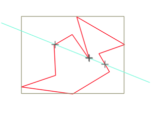
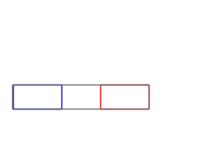
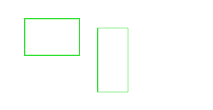
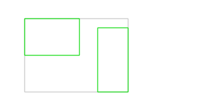

# Graphical showcase

[Manual main page](homog2d_manual.md)

On this page, some graphical demos, all generated with programs in misc/showcase, with `$ make showcase`
 
Requires Opencv (to generate images) and ImageMagick (to generate the final gif).

* The front page demo

* A rotating Polyline object and its intersection with a line

* Two dancing rectangles and their bounding box

* intersection and union areas of two rectangles

