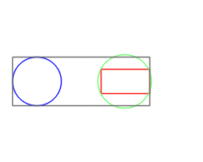

# Graphical showcase

[Manual main page](homog2d_manual.md)

On this page, some graphical demos, all generated with programs in misc/showcase, with `$ make showcase`
 
Requires Opencv (to generate images) and ImageMagick (to generate the final gif).

* The front page demo. The moving circle turns red when it is detected as inside the rectangle or the other circle.

* A rotating Polyline object, its bounding box, and its intersection with a line.

* Two dancing rectangles and their common bounding box.

* Intersection and union areas of two rectangles.

