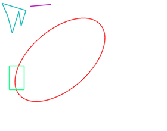
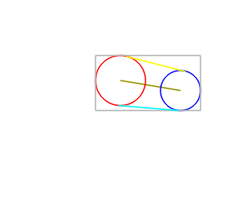
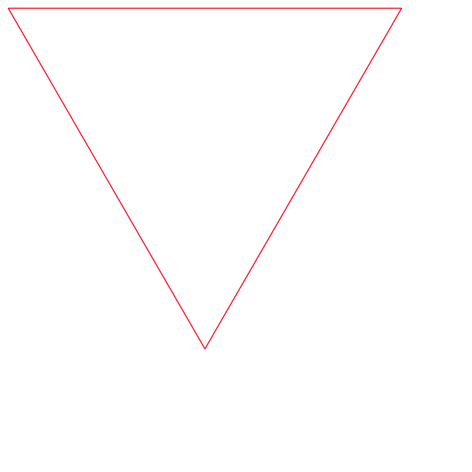
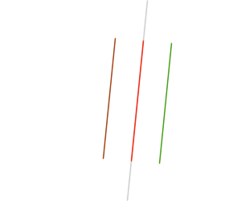
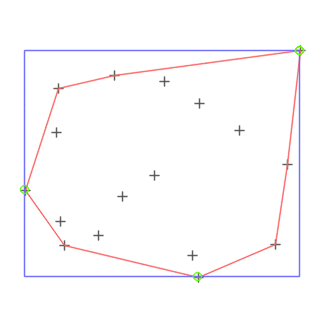
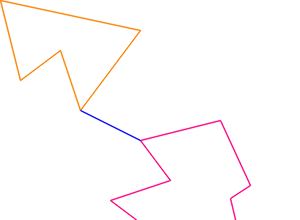
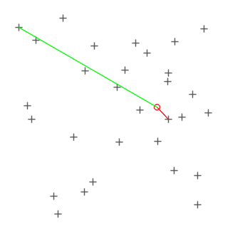

# Graphical showcase

[Manual main page](homog2d_manual.md)

On this page, some graphical demos as gif images, all generated with programs in misc/showcase with `$ make showcase`
 
Requires Opencv (to generate images) and ImageMagick (to generate the final gif).

Note: 20221205: check out [this other page](homog2d_showcase2.md) for more demos.

* [Showcase 1](../misc/showcase/showcase1.cpp): The front page demo.
The moving circle turns red when it is detected as inside the rectangle or the other circle.

* [Showcase 3](../misc/showcase/showcase3.cpp):
A rotating Polyline object, its bounding box, and its intersection with a line.

* [Showcase 4](../misc/showcase/showcase4a.cpp):
Two dancing objects (Circle and FRect) and their common bounding box.
Also show the rectangle's bounding circle and the circle's bounding box.

* [Showcase 2a](../misc/showcase/showcase2a.cpp) and [Showcase 2b](../misc/showcase/showcase2b.cpp):

Intersection and union areas of two rectangles.

* [Showcase 5](../misc/showcase/showcase5.cpp):
A rotating ellipse with its center point (green), its axis lines, and its two bounding boxes (one aligned with its axis, the other xy-aligned).

* [Showcase 6](../misc/showcase/showcase6.cpp):
Building circles from two (blue) or three (red) points, with one of the points rotating in the image.
Also shows intersection of circles with a segment.

* [Showcase 7](../misc/showcase/showcase7.cpp):

A demo showing when a closed polyline and a circle are inside each other.
Red and bold drawing when inside the other.
Also shows the intersection points between these two primitives.

* [Showcase 7b](../misc/showcase/showcase7b.cpp):

Same as above but with a rectangle and a cirle.

* [Showcase 7c](../misc/showcase/showcase7c.cpp):

Shows a moving segment that turns red and bold when inside a rectangle, a circle, and a closed polyline.
Also draws the intersection point, if any.

* [Showcase 7d](../misc/showcase/showcase7d.cpp):

Shows a fixed ellipse with other objects moving around and turning bold when inside the ellipse.

* [Showcase 8](../misc/showcase/showcase8.cpp):

A rotating point, a fixed segment and a fixed line.
The blue segment is generated between the point and the line, using `getOrthogSegment()`.
The other segment shows the distance between the point and the fixed segment, with two alternate colors showing the case (orthogonal distance or distance to segment edge).

* [Showcase 9](../misc/showcase/showcase9.cpp):

A circle rotating around another fixed one.
Shows the segment joining the centers, the tangential segments, and the common bounding box.
Also shows the lines orthogonal to the joining segment at circles center.

* [Showcase 10](../misc/showcase/showcase10.cpp):

Recursive building of a
[Sierpiński triangle](https://en.wikipedia.org/wiki/Sierpi%C5%84ski_triangle)
that slowly rotates in the image.

* [Showcase 11](../misc/showcase/showcase11.cpp):

a moving segment, its supporting line, and its two parallel segments.

* [Showcase 13](../misc/showcase/showcase13.cpp):

Random points, the corresponding Convex Hull and Bounding Box, and the extremum points (green).

* [Showcase 14](../misc/showcase/showcase14.cpp):

Two moving polygons, shows their intersection points and the closest points between them (blue segment).

* [Showcase 15](../misc/showcase/showcase15.cpp):

A rotating circle, a bunch of random points, and the segment between the point and the nearest/farthest point of the set.

