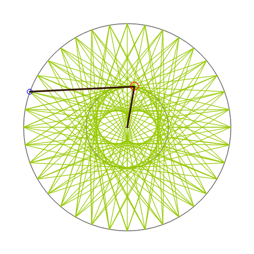

# Other graphical showcase demos

[Manual main page](homog2d_manual.md)

On this page, some more graphical demos as images, all generated with programs in
[misc/showcase_v](../misc/showcase_v), with `$ make showcase2`
<br>
This latter target only build the programs, but you can build png image files and corresponding videos with
```
$ misc/showcase_v/build_vid.sh
```
(Requires Opencv and ffmpeg)


* Spirograph-like generated images

[source](../misc/showcase_v/showcase_v_01.cpp)


  * 

  * 
