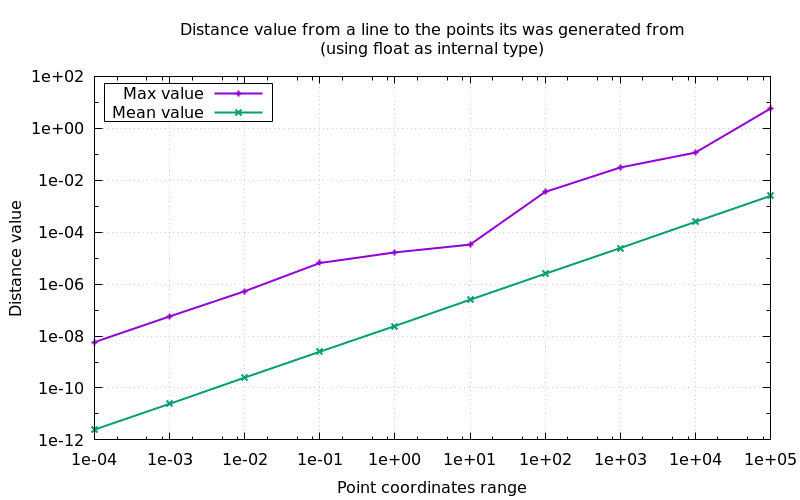

## Technical details on thresholds an how to manage them

[Manual main page](homog2d_manual.md)


- When checking for parallel lines (see Root::isParallelTo() ), the "null" angle value
has a default value of one thousand of a radian (0.001 rad).
You can print the current value with:
```C++
cout << "default null angle=" << thr::nullAngleValue() << " rad.\n";
```
It can be changed any time with the same function, for example:
```C++
thr::nullAngleValue() = 0.01; // 1/100 radian
```
This is checked for when computing an intersection point.

- When attempting to compute a line out of two points, the library will throw if
the distance between the two points is less than `thr::nullDistance()`.
That same function can be used to change (or print) the current value.

- When attempting to compute the inverse of a matrix, if the determinant is less
than `thr::nullDeter()`, the inversion code will throw.

### Changing thresholds at build time

You can define values for theses symbols before the "include" line to change the default values.
Example:
```
#define HOMOG2D_THR_ZERO_DIST 1E-10
#include "homog2d.hpp"
```

* `HOMOG2D_THR_ZERO_DIST`: default value for null distance, i.e. two points whose distance is less than this value will be considered identical points.
* `HOMOG2D_THR_ZERO_ORTHO_DIST`: default value for othogonal distance.
* `HOMOG2D_THR_ZERO_ANGLE`: default value for an angle value to be considered null (value must be given in rad.).
* `HOMOG2D_THR_ZERO_DENOM`: default value for a denominator to be considered null.
* `HOMOG2D_THR_ZERO_DETER`: default value for a matrix determinant to be considered null, thus the matrix will not be inversed.

### Changing thresholds at run time

In your code, these value can be read/written any time, using the same functions.
They all lie in the sub-namespace `thr`:

Example:
```
auto curr = << thr::nullDistance();  // store current value
thr::nullDistance() = 1E-6;          // change value
...                                  // do some stuf
thr::nullDistance() = curr;          // restore previous value
```

There is one function per symbol above:
* `thr::nullDistance()`
* `thr::nullOrthogDistance()`
* `thr::nullAngleValue()`
* `thr::nullDenom()`
* `thr::nullDeter()`

### How should I fix the thresholds?

If you feel you need to change from the default values, it depends greatly on the numerical range of your data.

Below is a plot that shows the result of an experiment (code is provided).
It shows the distance (max and mean value) between a line and the points it was generated with.
When you build a line using two points (line = pt1 * pt2), the distance between the computed line and both of the points should be 0.
But (as you got it), its not. And that is the distance that is shown on the plot below.

This is done on 1 M random point coordinates, in the range shown on horizontal axis, for the 3 available internal numerical types (`HOMOG2D_INUMTYPE`).




To run this yourself and generate the plot:
<br>
(requires gnuplot)
```
$ make dtest1
```

