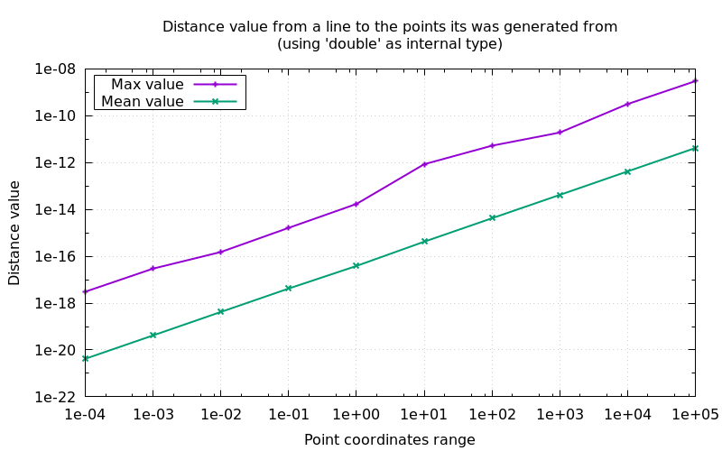
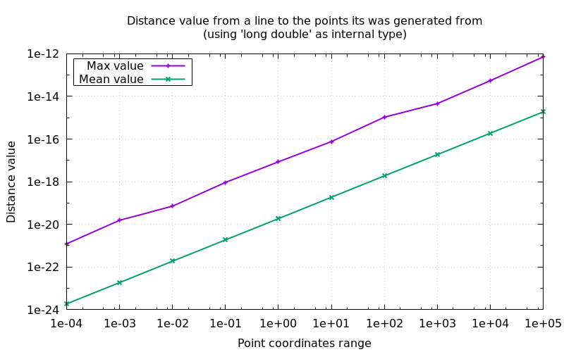

## Technical details on thresholds an how to manage them

[Manual main page](homog2d_manual.md)

As this library does not use arbitrary precision arithmetic, it may suffer from the weaknesses of traditional floating-point computation.
Thus several thresholds are used to manage numeric issues.
They are used in the situations described below.

### 1 - Situations

* Checking for parallel lines (see `isParallelTo()` )is done by computing the angle between the lines.
If it is below a threshold, the function returns true.
The default value is one thousand of a radian (0.001 rad).
This is checked for when computing an intersection point between two  lines/segments, for example when attempting to build a point from 2 lines.

* When attempting to compute a line out of two points, if the distance between the two points is less than `thr::nullDistance()`,
then the library will throw an exception.

* When attempting to compute the inverse of a matrix, if the determinant is less
than `thr::nullDeter()`, the inversion code will throw.


All the thresholds have default values.
These can be changed at build time, globally, but the values can also be changed at runtime.

### 2 - Changing thresholds at build time

You can define values for these thresholds before the "include" line, by assigning a value to a symbol.
For example:
```
#define HOMOG2D_THR_ZERO_DIST 1E-10
#include "homog2d.hpp"
```

These are the symbols to use:

* `HOMOG2D_THR_ZERO_DIST`: default value for null distance, i.e. two points whose distance is less than this value will be considered identical points.
* `HOMOG2D_THR_ZERO_ORTHO_DIST`: default value for othogonal distance.
* `HOMOG2D_THR_ZERO_ANGLE`: default value for an angle value to be considered null (value must be given in rad.).
* `HOMOG2D_THR_ZERO_DENOM`: default value for a denominator to be considered null.
* `HOMOG2D_THR_ZERO_DETER`: default value for a matrix determinant to be considered null, thus the matrix will not be inversed.

### 3 - Changing thresholds at run time

In your code, these value can be read/written any time, using the same functions.
They all lie in the sub-namespace `thr`:

Example:
```
auto curr = thr::nullDistance();  // store current value
thr::nullDistance() = 1E-6;       // change value
...                               // do some stuff
thr::nullDistance() = curr;       // restore previous value
```

There is one function per symbol above:
* `thr::nullDistance()`
* `thr::nullOrthogDistance()`
* `thr::nullAngleValue()`
* `thr::nullDenom()`
* `thr::nullDeter()`

### 4 - What value should I use for the thresholds?

Precision of computation and the associated threshold values greatly depend on the numerical range of your data.

Below is a plot that shows the result of an experiment (code is provided).
It shows the distance (max and mean value) between a line and the points it was generated with.
When you build a line using two points (line = pt1 * pt2), the distance between the computed line and both of the points should be 0.
But (as you got it), its not. And that is the distance that is shown on the plot below.

This is done on 1 M random point coordinates, in the range shown on horizontal axis,
using `double` and `long double` as internal numerical type (`HOMOG2D_INUMTYPE`).

As expected, the results are directly related to the numerical type used for computations,
and are better of approximately 10^3 when using `long double`.




To run this yourself and generate the plot:
<br>
(requires gnuplot)
```
$ make dtest1
```

### 5 - Additional rounding

In some situations, although the math is clear, some numerical issues always happen.
The most crucial is when computing intersection points between a rectangle and a line.
The algorithm just checks the intersection points between each of the 4 segments of the rectangle and the line:
for each segments supporting line, we check if the intersection point is in the segment area.
However, due to numerical issues, this can fail: for example, say we want to check the intersection between a line and an rectangle 100x100
(i.e. with coordinates in the range [0-99]).
The intersection point can appear to have for one of the coordinates the value "99". So far so good.
Unfortunately, the range checking will fail, because the actual computed value will be "99.00000000000123".

To avoid this issue, the "Segment/Line" intersection code will proceed with an additional rounding of the computed coordinates,
so that the value stays at "99":
```
value = std::round( value * coeff ) / coeff
```

The coefficient value has a default value of 1E6 but this can be adjusted globally at compile time by defining the value of the symbol `HOMOG2D_ROUNDING_COEFF`.
