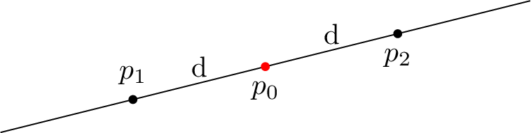

# Manual

Home page: https://github.com/skramm/homog2d

1. [Introduction](#intro)
2. [Lines and points](#basic)
3. [2D transformation (aka homographies)](#matrix)
4. [Intersection with rectangles and circles](#inter)
5. [Bindings](#bind)
6. [Numerical data types](#numdt)
7. [Technical details](#tech)
8. [History](#history)


## 1 - Introduction
<a name="intro"></a>

All the code is in the namespace `homog2d`, so either add `using namespace homog2d`, either use it as a prefix on each type.

This library provides 3 data types: `Line2d`, `Point2d` and  `Homogr`, this latter one implementing a planar (2D) transformation, implemented as a 3x3 matrix.

## 2 - lines and points
<a name="basic"></a>

- Create a 2D point:
```C++
Point2d pt1;       // 0,0
Point2d pt2(3,4);
```

- Create a 2D line:
```C++
Line2d li1;             // vertical line at x=0
Line2d li2( 3, 4 );     // line passing through (0,0) and (3,4)
```

- Create a point from two lines, and a line from two points:
```C++
Point2d pt3( li1, li2 );
Line2d  li3( pt1, pt2 );
```

- Get a line from two points, and a point from two lines:
```C++
pt1 = li1 * li2;
li1 = pt1 * pt2;
```

Beware, two parallel lines will never cross, and two identical points do not define a line.
So if you code attempts to do so, this will trigger a
[std::runtime_error](https://en.cppreference.com/w/cpp/error/runtime_error)
exception.

- Add some offset to a line:
```C++
li1.addOffset( OD_Horiz, 5 ); // horizontal offset
li1.addOffset( OD_Vert, 5 ); // vertical offset
```

- Compute distances from line to point or from point to point:
```C++
Line2d li;        // some line
Point2d pt1, pt2; // some points
auto dist1 = li1.distTo( pt1 );   // distance from line to point
auto dist2 = pt2.distTo( pt1 );   // distance from point to point
auto dist3 = pt1.distTo( li1 );   // but this is fine too
auto dist3 = pt1.distTo( pt2 );   //

Line2d li2;
// auto dist = li.distTo( li2 );   //
```

### Get point(s) lying on line

To get a point lying on a line, you can provide one of its coordinates and get the other coordinate value, using the enum
`En_GivenCoord`.
For example, if you build the line going through (0,0)-(4,2) with:

```C++
Line2d li(4,2);
```
You can compute the coordinate of y for x=2 with:
```C++
auto y = li.getCoord( GC_X, 2 );
```
of get the coordinate of x for y=1 with:
```C++
auto x = li.getCoord( GC_Y, 1 );
```

You can also get directly the point with:
```C++
Point2d pt2 = li.getPoint( GC_X, 2 );
```

The values `GC_Y`,`GC_Y` are just a two-values `enum`.

### Points at equal distance from a point on line
<a name="paedfapol"></a>

You can compute the two points that are lying on a line and at a given distance from a point.



The "middle" point must be given as either its x or y coordinate [(1)](#fn1).
```C++
Line2d li( ..., ... ); // some line
auto ppts = li.getPoints( GC_X, coord, dist );
Point2d p1 = ppts.first;
Point2d p2 = ppts.second;
```

Upon return, the "first" point will hold the one with smallest 'x' coordinates, or the smallest 'y' coordinates if x coordinates are equal.

### Orthogonal and parallel lines, angles between two lines

You can compute a line orthogonal to another one at a given coordinate, using the above enum.
For example, this:
```C++
Line2d li2 = li.getOrthogonalLine( GC_X, 2 );
```
will compute the orthogonal line at `x=2`.


You can get a line parallel to another one with the member function `getParallelLine()`.
This function takes as argument a point that the line will intersect.

```C++
Line2d li; // some line
Point2d pt; // some point
Line2d li2 = li.getParallelLine( pt ); // pt will be lying on li2
```

You can compute the angle in Radians between two lines, either with a member function or with a free function:
```C++
auto angle1 = li2.getAngle( li1 );
auto angle2 = getAngle( li1, li2 );
```

## 3 - Homographies
<a name="matrix"></a>

You can manipulate 2D transformations as 3x3 homogeneous matrices (aka "Homography").
The three basic transformations (rotation, translation, scaling) are available directly through provided member functions.
They are available in two forms: "`setXxxx()`" and "`addXxxx()`".
The first one starts from the identity transformation and applies the requested one.
The second form adds the requested transformation to the matrix.

- First example:
```C++
Homogr h; // unit transformation
h.setTranslation(3,4);
Point2d pt1(1,2);
Point2d pt2 = h * pt1; // pt2 is now (4,6)
h.clear; // reset to unit transformation
```

- You can build some complex transformation by multiplying these:
```C++
Homogr h; // unit transformation
h.setTranslation(3,4);
Homogr h2( 45. * M_PI / 180.); // 45° rotation matrix
Homogr h3a = h1*h2; // first, rotation, then translation
Homogr h3b = h2*h1; // first, rotation, then translation
```

- But you can also used "chained" syntax:
```C++
Homogr h; // unit transformation
h.addTranslation(3,4).addRotation( 45. * M_PI / 180.).addTranslation(-3,-4);
```

- You can access individual values of the matrix (read or write).
This is needed if you want to set up some specific transformation (shearing, perspective, whatever):
```C++
h.setValue( 0, 0, 3.14 );
auto v = h.getValue( 0, 0 ); // 3.14
```

To fill the matrix with arbitrary values, the best is to build it from a "vector of vectors", as in the example below:
```C++
std::vector<std::vector<float>> m = {
	{ 1,  0,  2 },
	{ 0,  1, -1 },
	{ 0,  0,  1 }
};
Homogr F = m;
```

You can also use `std::array` if needed.


- You can apply the homography to a set of points or lines:
```C++
std::vector<Point2d> v_pts;
... // fill with values
h.applyTo( v_pts );
```
This actually works with any other container on whom one can iterate, such as `std::array` or `std::list`.

- You can compute the inverse and/or the transpose of the matrix:
```C++
h.inverse();
h.transpose();
h.inverse().transpose(); // first, invert, second, transpose
```

## 4 - Computation of intersection points
<a name="inter"></a>

### Intersection of lines with flat rectangles

You can compute the intersection of a line with a flat rectangle defined by two points with the
`intersectsRectangle()` member function.
It will return a `Intersect` object that holds the intersection points.

Usage:

```C++
Line2d li( ..., ... ); // some line
Point2d pt1(1,1);
Point2d pt2(8,8);
auto ri = li.intersectsRectangle( pt1, pt2 );
if( ri() )  // means the line does intersect the rectangle defined by (1,1)-(8,1)-(8,8)-(1,8)
{
	Point2d intersect_pt1 = ri.get().first;
	Point2d intersect_pt2 = ri.get().second;
}
```

You don't have to give the bottom-right, top-left corners of the rectangle, the function checks and automatically computes these two points.
In the example above, you could have as well give the points (1,8)-(8,1), the result would have been the same.
The only requirement is that no coordinate must be the same in the two points.

### Intersection of a line with a circle

For a line `li`, you can compute the intersection points wit a circle having a radius `rad` and located at `pt` with the following code:
```C++
auto ri = li.intersectsCircle( pt, rad );
if( ri() )   // means the line intersects the circle
{
	auto inter = ri.get();
	Point2d intersect_pt1 = inter.first;
	Point2d intersect_pt2 = inter.second;
}
```

Also see the provided demo for a runnable example.


For both of these functions, the returned pair of intersection points will always hold as "first" the point with the lowest `x` value, and if equal, the point if the lowest `y` value.


### Points and rectangles

You can quickly check if a points lies within a rectangle defined by two points `p1`,`p2` with:
```C++
bool b = pt.isInsideRectangle( p1, p2 );
```
Again, the two points can be any of the four corners of the rectangle.

## 5 - Bindings with other libraries
<a name="bind"></a>

Import from other types is pretty much straight forward.
For points, a templated constructor is provided that can be used with any type having an 'x' and 'y' member.
For homographies, you can import directly from
`std::vector<std::vector<T>>` or `std::array<std::array<T,3>,3>`.
For the first case, it is mandatory that the all 4 vectors size is 3 (the 3 embedded ones and the global one).

For export, additional functions are provided to interface with [Opencv](https://opencv.org).
This is enabled by defining the symbol `HOMOG2D_USE_OPENCV` at build time.
You can then write this:
```C++
Point2d pt;
...
cv::Point2d ptcv1 = pt.getCvPtd(); // integer coordinates (with rounding)
cv::Point2f ptcv2 = pt.getCvPtf(); // floating-point coordinates
```

You can also directly draw points and lines on an image (`cv::Mat`):
```C++
Point2d pt( ... );
Line2d li( ... );
li.drawCvMat( mat );
pt.drawCvMat( mat );
```

Please note that for lines, this will draw a line spanning the whole image, as opposed to
the Opencv function `cv::line()` that actually draws a **segment** only.
For points, this will just draw a small cross: 2 H/V lines.

These two functions support a second optional argument of type `CvDrawParams` that holds various parameters for drawing.
So you can for example set the color and line width with:
```C++
li.drawCvMat( mat, CvDrawParams().setThickness(2 /* pixels */).setColor( r,g,b) );
```
with r,g,b as bytes (`uint8_t`) in the range [0,255].

The drawing parameters default values can be changed anytime with a call to `setDefault()`,
and values will be retained, unless explicitely changed, as showed in the example below;

```C++
CvDrawParams dp; // default line thickness is 1
dp.setColor( 0,  0, 250).setThickness(3);
dp.setDefault();
line.drawCvMat( some_img ); // use default settings
line.drawCvMat( some_img. CvDrawParams().setColor( 0,0,0) ); // warning, black, but line thickness=3 !
```

You can at any time return to the "factory" settings with a call to a static function:
```C++
CvDrawParams::resetDefault();
```

A demo demonstrating this Opencv binding is provided, try it with
`make demo` (requires of course that Opencv is installed on your machine).

## 6 - Numerical data types
<a name="numdt"></a>

The library is fully templated, the user has the ability to select for each type either
`float`, `double` or `long double` as underlying numerical datatype, on a per-object basis.

The default datatype used for `Point2d`, `Line2d` or `Homogr` is `double`.
The other types can be selected by an additional suffix letter added after the type:

`F` for `float`, `D` for `double` and `L` for `long double`.

For example: `Point2dF`, `Line2dF` or `HomogrF` are float types.

If you prefer the classical template notation, it is also available by using `Point2d_` and `Line2d_`, which are templated types:

```
Point2d_<float> pt; // this is fine
```

## 7 - Technical details
<a name="tech"></a>

- The two types `Point2d` and `Line2d` are actually the same class,
behavior differs due to some policy-based design (see below).
- Points are stored as non-normalized values, any computation will keep the resulting values.
Normalization is done for comparison but not saved.
- Lines are always stored as normalized values (a^2+b^2 = 1)
- Homographies are stored as normalized values, either as h33=1, or (if null) as h23=1, or (if null) as h13=1

### Testing

A unit-test program is included, it is build and run with `make test`.
If you have Opencv installed on your machine, you can run the additional tests that make sure the Opencv binding stuff runs fine by passing make option `USE_OPENCV=Y`:
```
make test USE_OPENCV=Y
```

### Build options
<a name="options"></a>

Below are some options that can be passed, to activate them, just define the symbol.
You can do that in the makefile or just add a `#define` on top of your program,
**before** the `#include "homog2d"`

- `HOMOG2D_USE_OPENCV`: enable the Opencv binding, see [Bindings](#bind).

(TO BE EXPANDED)


### Inner details

To be able to templatize all the code on the root numerical data type (float, double, ...), we implement some trick.
As the Root class is already templatized on the type (Point or Line),
it would require a partial template specialization to define the behavior of each member function (or free function),
depending on the basic type (Line or Point), and still templatize on the numerical type.
C++ does not allow this |-(.

Thus, the trick here is to call in each function a "sub" private function (prefixed with `impl_`) that gets overloaded
by the datatype (point or line).
To achieve this overloading, each of these functions receives as additional (dummy) argument an object of type RootHelper,
templated by the numerical type.
In the definition of the function, this additional argument is ignored,
it is there just so that the compiler can select the correct overload
(in a similar way of what happens with templates).

The two implementations (for points and for lines) are written as two `impl_` private functions that are templated by the numerical data type.

## 8 - History
<a name="history"></a>

See [Release page](https://github.com/skramm/homog2d/releases).

- [v1.0](https://github.com/skramm/homog2d/releases/tag/v1.0): initial release, not templated by numerical data type. Same API, works fine. A bit lighter on template stuff.
- [v2.0](https://github.com/skramm/homog2d/releases/tag/v2.0): latest release, fully templated.

- current master branch API changes:
  - added `intersectsCircle()`, to get intersection with circles
  - intersection data structure name changed, now `Intersect`
  - the intersection points are now private, they must be fetched with `get()`: this `Intersect` member function will return a `std::pair` holding the two intersection points.
  - added `getPoints()`
  - added single argument constructors
  - renamed `distToPoints()` member function: now `distTo()`, and be used with lines as argument.

### Footnotes

[(1)](#paedfapol)
<a name="fn1"></a> The rationale behind this interface is that if we had choosen to pass a point as argument, no guarantee would have been given that the point is effectively lying on the line.
With this function signature, the function can compute the point itself.
